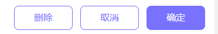

# 底部多样按钮

## 预览



## 代码演示

### 基础用法

```vue
      <HrBottomButton :list="list" @clickButton='clickButton' />
```

```javascript
export default {
  data() {
    return {
      list: [
        {
          text: '删除',
          icon: '',
        },
        {
          text: '取消',
          icon: '',
        },
        {
          text: '确定',
          icon: '',
        }
      ],
      }
    },
    methods: {
      clickButton (index) {
        console.log(index)
      },
    }
  }
```