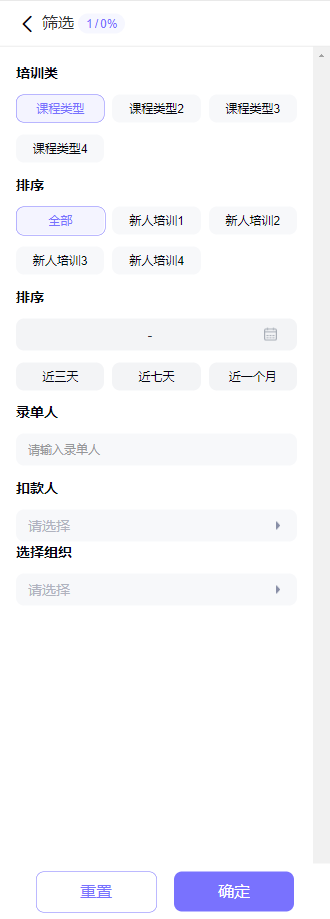

# 筛选组件（内含多个子组件）

## 预览



## 代码演示

### 基础用法

```vue
  <HrConditionFiltrate v-model="isShowFiltrate" />
```

```javascript
export default {
  data() {
    return {
        isShowFiltrate: false
      }
    }
  }
```