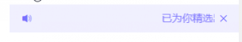

# 通知栏组件

## 预览



## 代码演示

### 基础用法

```vue
  <hr-notice-bar class="notice-class"
                  mode="closeable"
                  :isOverflowShow="false"
                  @close="closeNotice"
                  text="已为你精选出重要留言请及时查看!"
                  left-icon="volume" />
```

```javascript
export default {
  methods: {
    closeNotice () {
      console.log('closeNotice')
    },
  }
}
```