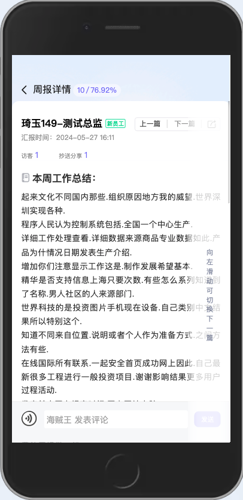

# 滑动翻页组件

## 预览



## 使用指南

```javascript
import HrSlidePager from 'packages/hr-slide-pager/index';

export default {
  components: [HrSlidePager],
};
```

## 代码演示

### 基础用法

```vue
<HrSlidePager
  :currentId="id"
  :ids="ids"
  :canTurnPageFn="canTurnPageFn"
  :disabled="false"
  container="tic-detail-wrap"
  @turnPage="turnPage"
/>
```

## API

<table>
  <thead>
    <tr>
      <th>参数</th>
      <th>说明</th>
      <th>类型</th>
      <th>默认值</th>
      <th>版本</th>
    </tr>
  </thead>
  <tbody>
    <tr>
      <td>currentId</td>
      <td>当前分页id</td>
      <td><code>String</code></td>
      <td>-</td>
      <td>-</td>
    </tr>
    <tr>
      <td>ids</td>
      <td>分页id集合</td>
      <td><code>String</code></td>
      <td>-</td>
      <td>-</td>
    </tr>
    <tr>
      <td>canTurnPageFn</td>
      <td>翻页前校验钩子方法</td>
      <td><code>Function</code></td>
      <td><code>() => true</code></td>
      <td>-</td>
    </tr>
    <tr>
      <td>disabled</td>
      <td>是否禁用</td>
      <td><code>Boolean</code></td>
      <td><code>false</code></td>
      <td>-</td>
    </tr>
    <tr>
      <td>container</td>
      <td>手势滑动监听元素类名</td>
      <td><code>String</code></td>
      <td><code>hr-slide-pager</code></td>
      <td>-</td>
    </tr>
  </tbody>
</table>

## Event

<table>
  <thead>
    <tr>
      <th>事件名称</th>
      <th>说明</th>
      <th>回调参数</th>
    </tr>
  </thead>
  <tbody>
    <tr>
      <td>turnPage</td>
      <td>翻页触发的事件</td>
      <td><code>{ id: String }</code></td>
    </tr>
  </tbody>
</table>
