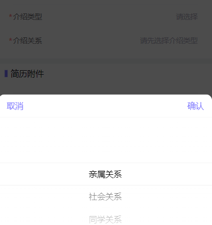

# field + popup + picker 选择器

## 预览
  

## 使用指南

```javascript
import HrSelect from 'packages/hr-select/index'

export default {
  components: [HrSelect]
}
```

## 代码演示

### 基础用法

用于只改变绑定值，无需其他操作时，使用 v-model 即可
```vue

<HrSelect :show.sync="isShow"
          v-model="form.name"
          :value="form.name | lookup('hrms_employee_kinship_type')"
          name="name"
          label="介绍类型"
          :required="true"
          :rules="[{ required: true, message: '请选择介绍类型' }]"
          :columns="columns"
          input-align="right" />
```
```javascript
export default {
  data() {
    return {
      form: {
        name: '李小龙'
      },
      // popup 弹窗
      isShow: false,
      // 与 vant picker 结构一致
      columns: [
        {
          code: '',
          text: ''
        },
        {
          code: '',
          text: ''
        }
      ]
    }
  }
}
```

### 复杂场景

用于选择后需要处理业务逻辑时，可以绑定 select 事件（与 v-model 两者可以共存，不冲突）
```vue
<HrSelect :show.sync="isShow"
          :value="form.name | lookup('hrms_employee_kinship_type')"
          name="name"
          label="介绍类型"
          :required="true"
          :rules="[{ required: true, message: '请选择介绍类型' }]"
          :columns="columns"
          input-align="right"
          @select="onConfirm">
```
```javascript
export default {
  data() {
    return {
      form: {
        name: '李小龙'
      },
      // popup 弹窗
      isShow: false,
      // 与 vant picker 结构一致
      columns: [
        {
          code: '',
          text: ''
        },
        {
          code: '',
          text: ''
        }
      ]
    }
  },
  methods: {
    onConfirm (res) {
      // 对象
    }
  }
}
```


## API

<table>
  <thead>
    <tr>
      <th>参数</th>
      <th>说明</th>
      <th>类型</th>
      <th>默认值</th>
      <th>版本</th>
    </tr>
  </thead>
  <tbody>
    <tr>
      <td>v-model</td>
      <td>需要改变的值</td>
      <td><code>String</code></td>
      <td>-</td>
      <td>-</td>
    </tr>
    <tr>
      <td>show</td>
      <td>popup弹出层</td>
      <td><code>Boolean</code></td>
      <td>-</td>
      <td>-</td>
    </tr>
    <tr>
      <td>其他</td>
      <td>其他参数与 vant 一致</td>
      <td>-</td>
      <td>-</td>
      <td>-</td>
    </tr>
  </tbody>
</table>

## Event

<table>
  <thead>
    <tr>
      <th>事件名称</th>
      <th>说明</th>
      <th>回调参数</th>
    </tr>
  </thead>
  <tbody>
    <tr>
      <td>select</td>
      <td>选择时触发的事件</td>
      <td><code>{ xxx: String, xxx: String }</code></td>
    </tr>
  </tbody>
</table>